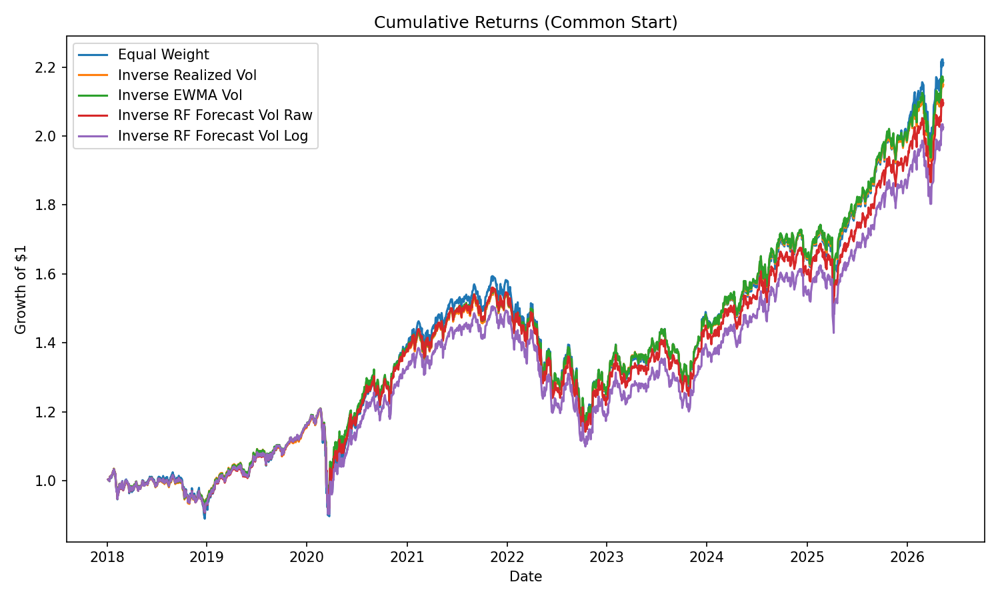

# VolRisk Pipeline Report

## Summary
This report was generated automatically by `scripts/run_pipeline.py`. It compares equal-weight,
inverse-volatility, EWMA-volatility, and Random Forest volatility forecast strategies.

The full-history metrics start when each strategy first has valid weights. The common-start
metrics rebase every strategy to the shared window from 2018-01-05 to
2026-05-13, which makes the Random Forest strategies comparable with the baselines.

## Full-History Results
| Strategy | Ann. Return | Ann. Vol | Sharpe | Max Drawdown | Avg. Turnover | Final Growth |
| --- | ---: | ---: | ---: | ---: | ---: | ---: |
| Equal Weight | 0.0983 | 0.1367 | 0.7544 | -0.2707 | 0.0000 | 2.8928 |
| Inverse Realized Vol | 0.0954 | 0.1220 | 0.8079 | -0.2513 | 0.0315 | 2.8070 |
| Inverse EWMA Vol | 0.0946 | 0.1218 | 0.8031 | -0.2511 | 0.0347 | 2.7841 |
| Inverse RF Forecast Vol Raw | 0.0929 | 0.1373 | 0.7159 | -0.2683 | 0.0330 | 2.0950 |
| Inverse RF Forecast Vol Log | 0.0884 | 0.1367 | 0.6882 | -0.2700 | 0.0321 | 2.0246 |

## Common-Start Results
| Strategy | Ann. Return | Ann. Vol | Sharpe | Max Drawdown | Avg. Turnover | Final Growth |
| --- | ---: | ---: | ---: | ---: | ---: | ---: |
| Equal Weight | 0.1000 | 0.1487 | 0.7158 | -0.2707 | 0.0000 | 2.2118 |
| Inverse Realized Vol | 0.0961 | 0.1319 | 0.7622 | -0.2513 | 0.0319 | 2.1481 |
| Inverse EWMA Vol | 0.0970 | 0.1316 | 0.7690 | -0.2511 | 0.0345 | 2.1614 |
| Inverse RF Forecast Vol Raw | 0.0929 | 0.1373 | 0.7159 | -0.2683 | 0.0330 | 2.0950 |
| Inverse RF Forecast Vol Log | 0.0884 | 0.1367 | 0.6882 | -0.2700 | 0.0321 | 2.0246 |

## Analysis
- The best full-history annualized return came from **Equal Weight**.
- The best full-history Sharpe ratio came from **Inverse Realized Vol**.
- On the common-start window, the highest final growth came from **Equal Weight**.
- Over the common-start window, the RF raw target variant produced the stronger RF result. RF raw ended at 2.0950 with Sharpe 0.7159, while RF log ended at 2.0246 with Sharpe 0.6882.
- The common-start chart is the fairest visual comparison because the RF strategies require
  an initial training window before producing out-of-sample forecasts.

## Conclusion
The RF raw-target strategy is the primary Random Forest benchmark to emphasize if it remains
stronger than the log-target variant. The common-start results should be used when comparing RF
against the baseline strategies, while the full-history results are useful for showing the longer
baseline context.
